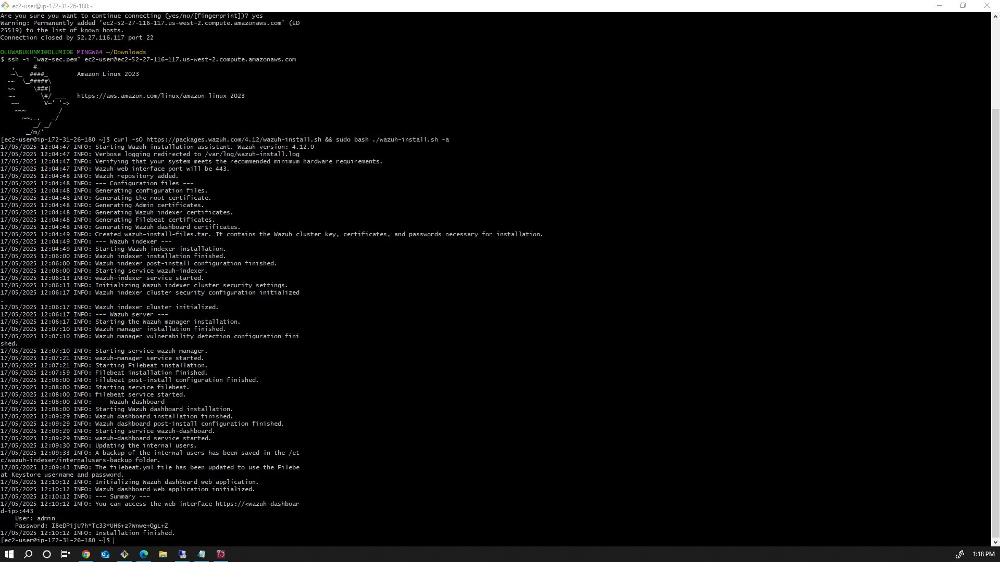

# 🧠 Home Lab: Wazuh-based SIEM in AWS

This lab demonstrates the setup of a Wazuh-based Intrusion Detection System (IDS) in AWS, reflecting real-world security operations in cloud environments. With cyberattacks like brute-force login attempts and port scans being common, this lab offers hands-on experience in deploying and responding to such threats.

In this lab, you will deploy a Wazuh server, register endpoint agents, simulate attacks from an attacker machine, and analyze alerts and logs through the Wazuh dashboard — mirroring typical incident detection/response workflows in a cloud AWS environment.

🎯 Objectives
- Deploy a Wazuh server on AWS EC2
- Register and manage endpoint agents through the Wazuh dashboard
- Perform simulated attacks including Hydra RDP brute force and Nmap scans
- Detect, investigate, and respond to security events in real-time via the Wazuh dashboard
- Mirror real-world incident detection and response workflows in a cloud environment

---

## 📚 Table of Contents

- [Prerequisites](#-prerequisites)
- [Network Topology](#-network-topology)
- [Step 1: Environment Setup](#-step-1-environment-setup)
  - [EC2 Configuration](#ec2-configuration)
  - [Security Groups](#security-groups)
- [Step 2: Wazuh Installation](#-step-2-wazuh-installation)
- [Step 3: Adding Endpoint Agents](#-step-3-adding-endpoint-agents)
- [Step 4: Confirm Agent Registration](#-step-4-confirm-agent-registration)
- [Step 5: Port Scan on Windows Target](#-step-5-port-scan-on-windows-target)
- [Step 6: Brute Force RDP with Hydra](#-step-6-brute-force-rdp-with-hydra)
- [Step 7: Detect Brute Force in Wazuh](#-step-7-detect-brute-force-in-wazuh)
- [Step 8: Investigate Source of Attack](#-step-8-investigate-source-of-attack)
- [Step 9: Vulnerability Detection (Ubuntu)](#-step-9-vulnerability-detection-ubuntu)
- [Next Steps & Future Improvements](#-next-steps--future-improvements)
- [Contributing](#-contributing)
- [Conclusion](#-conclusion)
- [Screenshot Folder Layout](#-screenshot-folder-layout)

---

## 📌 Prerequisites

- AWS account
- Basic understanding of cloud networking
- Familiarity with Linux, Windows, and CLI tools

---

## 🌐 Network Topology

```
+-------------------+            +-----------------------+
|                   | SSH, 443  |                       |
|   Wazuh Server    +<---------->  Target: Ubuntu       |
| AWS Linux 8 (4CPU)|            | Agent Installed       |
| 8GB RAM, 30GB     |            +-----------------------+
|                   | SSH, 443  |                       |
|                   +<---------->  Target: Windows 10   |
|                   |            | Agent Installed       |
|                   |            +-----------------------+
|                   | SSH       |                       |
|                   +<---------->  Kali (Attacker)      |
|                   |            | Hydra & Nmap Tools    |
+-------------------+            +-----------------------+
```

---

## 🚀 Step 1: Environment Setup

### EC2 Configuration

| Instance Name      | OS / AMI                 | vCPU | RAM  | Disk | Notes                     |
|--------------------|--------------------------|------|------|------|---------------------------|
| Wazuh Server       | AWS Linux 2              | 4    | 8GB  | 30GB | Main SIEM server          |
| Attacker (ubuntu)  | Ubuntu 22.04 LTS         | 2    | 4GB  |  -   | Penetration testing tools |
| Target 1 (Windows) | Windows Server 2022 Base | 2    | 4GB  | 30GB | RDP brute-force target    |
| Target 2 (Ubuntu)  | Ubuntu 22.04             | 2    | 4GB  |  -   | Linux endpoint            |

### Security Groups

- **(Intentional Misconfiguration)** Allow **all traffic from everywhere** (0.0.0.0/0, all protocols, all ports)  
  _⚠️ This is for demonstration only and is highly insecure!_
- Allow internal communication: TCP 443, 22
- Allow SSH from your IP
- Allow RDP (TCP 3389) from the attacker

---

## 🛠️ Step 2: Wazuh Installation

Install Wazuh on the AWS Linux server using the official guide:

```bash
curl -sO https://packages.wazuh.com/4.7/wazuh-install.sh
bash wazuh-install.sh -a
```

> **Note:** After installation, the Wazuh Dashboard credentials will be displayed:
> - **User:** `admin`
> - **Password:** `<randomly_generated>`
>
> Login via browser: `https://<WAZUH_SERVER_PUBLIC_IP>:443`



---

## 🎯 Step 3: Adding Endpoint Agents

### a. Windows Target Agent Installation

- Navigate to `Agents > Add Agent`
- Select Windows as OS
- Input IP of Wazuh Server (e.g., 172.31.0.10)
- Copy the generated installation link
- Run on Windows CLI as admin


### b. Ubuntu Target Agent Installation

- Repeat the same steps; choose Linux as OS
- Run the command on Ubuntu terminal


---

## 📊 Step 4: Confirm Agent Registration

- Confirm both agents show "Active" in the Wazuh dashboard.


---

## 🔎 Step 5: Port Scan on Windows Target

Use nmap from attacker machine:

```bash
nmap -sV -O -Pn <windows_target_ip>
```


---

## 🔓 Step 6: Brute Force RDP with Hydra

Use Hydra from Kali:

```bash
hydra -t 4 -V -f -l administrator -P /usr/share/wordlists/rockyou.txt rdp://<windows_target_ip>
```


---

## 📥 Step 7: Detect Brute Force in Wazuh

- Monitor alerts in Wazuh dashboard under Security Events


---

## 🕵️ Step 8: Investigate Source of Attack

- Trace origin of attack and impacted endpoint via log details


---

## 🩻 Step 9: Vulnerability Detection (Ubuntu)

- Wazuh performs vulnerability detection for Linux endpoints. Review critical CVEs:


---

## 🚀 Next Steps & Future Improvements

- Add MITRE ATT&CK mapping to events
- Integrate Splunk/ELK with Wazuh
- Explore threat intelligence feeds (AbuseIPDB, AlienVault OTX)
- Automate incident response using Playbooks (e.g., TheHive, Cortex)

---

## 🤝 Contributing

1. Fork this repo
2. Add your screenshots or improvements
3. Create a Pull Request

---

## ✅ Conclusion

This lab walks through a complete threat detection pipeline using Wazuh in AWS, from installation to attack simulation, detection, and investigation.

---

## 📁 Screenshot Folder Layout

```
/your-repo/
├── README.md
└── screenshots/
    ├── 1_wazuh_installation.png
    ├── 2a_adding_agent_windows.png
    ├── 2b_adding_agent_ubuntu.png
    ├── 3_agents_visible_dashboard.png
    ├── 4_nmap_scan_windows.png
    ├── 5_hydra_bruteforce_kali.png
    ├── 6_bruteforce_log_wazuh.png
    ├── 7_attacker_investigation.png
    └── 8_ubuntu_vulnerabilities_wazuh.png
```
